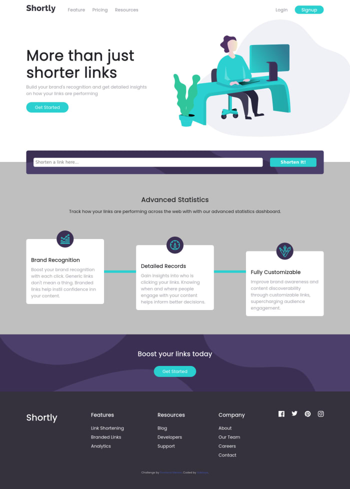

# Frontend Mentor - Shortly URL shortening API Challenge solution

This is a solution to the [Shortly URL shortening API Challenge challenge on Frontend Mentor](https://www.frontendmentor.io/challenges/url-shortening-api-landing-page-2ce3ob-G). Frontend Mentor challenges help you improve your coding skills by building realistic projects.

## Table of contents

- [Overview](#overview)
  - [The challenge](#the-challenge)
  - [Screenshot](#screenshot)
  - [Links](#links)
- [My process](#my-process)
  - [Built with](#built-with)
  - [What I learned](#what-i-learned)
  - [Continued development](#continued-development)
  - [Useful resources](#useful-resources)
- [Author](#author)
- [Acknowledgments](#acknowledgments)

**Note: Delete this note and update the table of contents based on what sections you keep.**

## Overview

### The challenge

Users should be able to:

- View the optimal layout for the site depending on their device's screen size
- Shorten any valid URL
- See a list of their shortened links, even after refreshing the browser
- Copy the shortened link to their clipboard in a single click
- Receive an error message when the `form` is submitted if:
  - The `input` field is empty

### Screenshot

### Links

- Solution URL: [View Solution](https://www.frontendmentor.io/solutions/html5-css3-flexbox-mobilefirst-workflow-vanilla-js-api-LP05bpCTwC)
- Live Site URL: [View Demo](https://shortly-umber-one.vercel.app)

## My process

### Built with

- Semantic HTML5 markup
- CSS custom properties
- Flexbox
- Mobile-first workflow
- JavaScript
- API

### What I learned

This challenge helped broadened my knowledge on APIs and local storage usage.

### Continued development

I hope to add more useful features to the project soon...

## Author

- Website - [Adetoye](https://adetoye.vercel.app)
- Frontend Mentor - [@adetoye-dev](https://www.frontendmentor.io/profile/adetoye-dev)
- Twitter - [@adetoye_dev](https://www.twitter.com/adetoye_dev)
